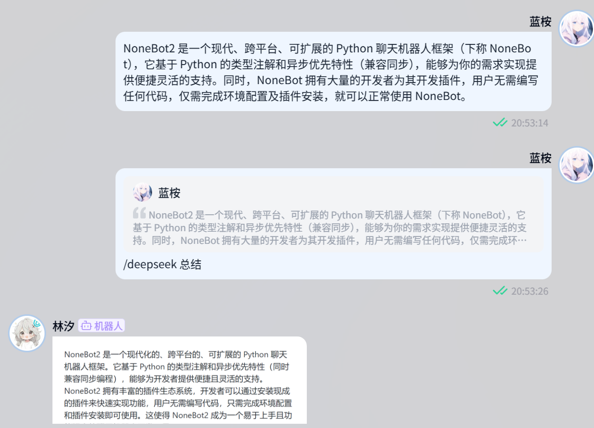

<!-- markdownlint-disable MD033 MD036 MD041 MD045 -->
<div align="center">
  <a href="https://v2.nonebot.dev/store">
    
  </a>
</div>

<div align="center">

# NoneBot-Plugin-DeepSeek

_✨ NoneBot DeepSeek 插件 ✨_

<a href="">
  
</a>

<a href="https://pdm.fming.dev">
  
</a>
<a href="https://github.com/nonebot/plugin-alconna">
  
</a>

<br/>

<a href="https://registry.nonebot.dev/plugin/nonebot-plugin-deepseek:nonebot_plugin_deepseek">
  
</a>
<a href="https://registry.nonebot.dev/plugin/nonebot-plugin-deepseek:nonebot_plugin_deepseek">
  
</a>

<br />
<a href="#-效果图">
  <strong>📸 演示与预览</strong>
</a>
&nbsp;&nbsp;|&nbsp;&nbsp;
<a href="#-安装">
  <strong>📦️ 下载插件</strong>
</a>
&nbsp;&nbsp;|&nbsp;&nbsp;
<a href="https://qm.qq.com/q/Vuipof2zug" target="__blank">
  <strong>💬 加入交流群</strong>
</a>

</div>

## 📖 介绍

NoneBot DeepSeek 插件。接入 DeepSeek 模型，提供智能对话与问答功能

## 💿 安装

以下提到的方法任选 **其一** 即可

> [!TIP]
> 想要启用 Markdown 转图片功能，需安装 `nonebot-plugin-deepseek[image]`

<details open>
<summary>[推荐] 使用 nb-cli 安装</summary>
在 Bot 的根目录下打开命令行, 输入以下指令即可安装

```shell
nb plugin install nonebot-plugin-deepseek
```

</details>
<details>
<summary>使用包管理器安装</summary>

```shell
pip install nonebot-plugin-deepseek
# or, use poetry
poetry add nonebot-plugin-deepseek
# or, use pdm
pdm add nonebot-plugin-deepseek
```

打开 NoneBot 项目根目录下的配置文件, 在 `[plugin]` 部分追加写入

```toml
plugins = ["nonebot_plugin_deepseek"]
```

</details>

## ⚙️ 配置

在项目的配置文件中添加下表中配置

> [!note]
> `api_key` 请从 [DeepSeek 开放平台](https://platform.deepseek.com/) 获取  
> `enable_models` 为 [`CustomModel`](https://github.com/KomoriDev/nonebot-plugin-deepseek/blob/ee9f0b0f0568eedb3eb87423e6c1bf271787ab76/nonebot_plugin_deepseek/config.py#L34) 结构的字典，若无接入本地模型的需要则无需修改  
> 若要接入本地模型，请参见：👉 [文档](./tutorial.md)  

|           配置项             |必填|                            默认值                            |                  说明                  |
|:---------------------------: |:--:|                 :---------------------------:                |             :-----------:             |
|      deepseek__api_key       | 是 |                              无                              |                API Key                |
|   deepseek__enable_models    | 否 |[{ "name": "deepseek-chat" }, { "name": "deepseek-reasoner" }]|启用的模型 [配置说明](#enable_models-配置说明)|
|       deepseek__prompt       | 否 |                              无                              |                模型预设                |
|     deepseek__md_to_pic      | 否 |                             False                            |        是否启用 Markdown 转图片        |
|deepseek__enable_send_thinking| 否 |                             False                            |             是否发送思维链             |
| deepseek__is_stream          | 否 |                             False                            |             是否流式输出              |

### `enable_models` 配置说明

`enable_models` 为 [`CustomModel`](https://github.com/KomoriDev/nonebot-plugin-deepseek/blob/ee9f0b0f0568eedb3eb87423e6c1bf271787ab76/nonebot_plugin_deepseek/config.py#L34) 结构的字典，用于控制不同模型的配置，包含的字段有

> [!TIP]
> 以下字段均在 [DeepSeek API 文档](https://api-docs.deepseek.com/zh-cn/) 有更详细的介绍  
> `deepseek-reasoner` 模型不支持 `logprobs` 和 `top_logprobs` 参数

- `name`: 模型名称（必填）
- `base_url`: 接口地址（默认为：<https://api.deepseek.com>）（自建模型必填）
- `api_key`: API Key（默认使用 `deepseek__api_key`）
- `prompt`: 模型预设（默认使用 `deepseek__prompt`）
- `max_tokens`: 模型生成补全的最大 token 数
  - `deepseek-chat`: 介于 1 到 8192 间的整数，默认使用 4096
  - `deepseek-reasoner`: 默认为 4K，最大为 8K
- `frequency_penalty`: 用于阻止模型在生成的文本中过于频繁地重复相同的单词或短语
- `presence_penalty`: 用于鼓励模型在生成的文本中包含各种标记
- `stop`: 遇到这些词时停止生成token
- `temperature`: 采样温度，不建议和 `top_p` 一起修改
- `top_p`: 采样温度的替代方案。不建议和 `temperature` 一起修改
- `logprobs`: 是否返回所输出 token 的对数概率
- `top_logprobs`: 指定在每个 token 位置返回最有可能的 tokens

配置示例:

```bash
deepseek__enable_models='
[
  {
    "name": "deepseek-chat",
    "max_tokens": 2048,
    "top_p": 0.5
  },
  {
    "name": "deepseek-reasoner",
    "max_tokens": 8000
  }
]
'
```

## 🎉 使用

> [!note]
> 请检查你的 `COMMAND_START` 以及上述配置项。这里默认使用 `/`

### 问答

```bash
/deepseek [内容]
```

快捷命令：`/ds [内容]` 或回复文本消息

### 多轮对话

```bash
/deepseek --with-context [内容]
```

快捷指令：`/ds --with-context [内容]` `/多轮对话`

### 深度思考

```bash
/deepseek [内容] --use-model deepseek-reasoner
```

快捷指令：`/深度思考 [内容]`

### 设置

> 权限：`设置默认模型` 指令仅 SUPERUSER 可用

```bash
# 查看支持的模型列表
/deepseek model -l|--list
# 设置默认模型
/deepseek model --set-default [模型名]
```

快捷指令：`/模型列表` `/设置默认模型 [模型名]`

### 余额

> 权限：SUPERUSER

```bash
/deepseek --balance
```

快捷指令：`/ds --balance` `/余额`

### 自定义快捷指令

> 该特性依赖于 [Alconna 快捷指令](https://nonebot.dev/docs/2.3.3/best-practice/alconna/command#command%E7%9A%84%E4%BD%BF%E7%94%A8)。自定义指令不带 `COMMAND_START`，若有必要需手动填写

```bash
# 增加
/deepseek --shortcut <自定义指令> /deepseek
# 删除
/deepseek --shortcut delete <自定义指令>
# 列出
/deepseek --shortcut list
```

例子:

```bash
user: /deepseek --shortcut /chat /deepseek --use-model deepseek-chat
bot: deepseek::deepseek 的快捷指令: "/chat" 添加成功
user: /chat
bot: (使用模型 deepseek-chat)
```

## 📸 效果图

<p align="center">
  <a href="https://github.com/KomoriDev/nonebot-plugin-deepseek" target="__blank">
    <picture>
      <source media="(prefers-color-scheme: dark)" srcset="./docs/screenshot-dark.png">
      <source media="(prefers-color-scheme: light)" srcset="./docs/screenshot-light.png">
      
    </picture>
  </a>
</p>

## 📄 许可证

本项目使用 [MIT](./LICENSE) 许可证开源

```text
THE SOFTWARE IS PROVIDED "AS IS", WITHOUT WARRANTY OF ANY KIND, EXPRESS OR
IMPLIED, INCLUDING BUT NOT LIMITED TO THE WARRANTIES OF MERCHANTABILITY,
FITNESS FOR A PARTICULAR PURPOSE AND NONINFRINGEMENT. IN NO EVENT SHALL THE
AUTHORS OR COPYRIGHT HOLDERS BE LIABLE FOR ANY CLAIM, DAMAGES OR OTHER
LIABILITY, WHETHER IN AN ACTION OF CONTRACT, TORT OR OTHERWISE, ARISING FROM,
OUT OF OR IN CONNECTION WITH THE SOFTWARE OR THE USE OR OTHER DEALINGS IN THE
SOFTWARE.
```
